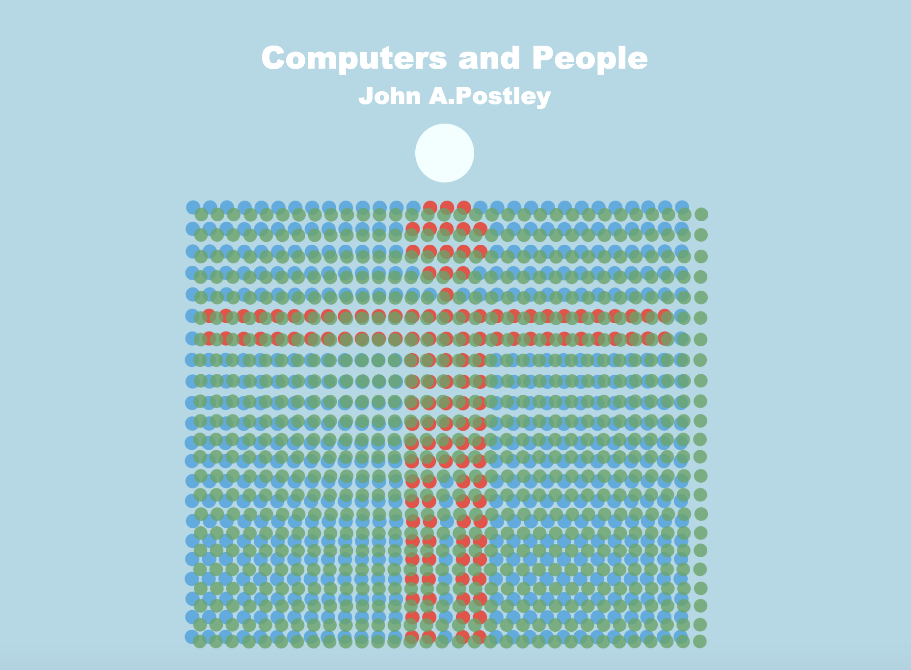
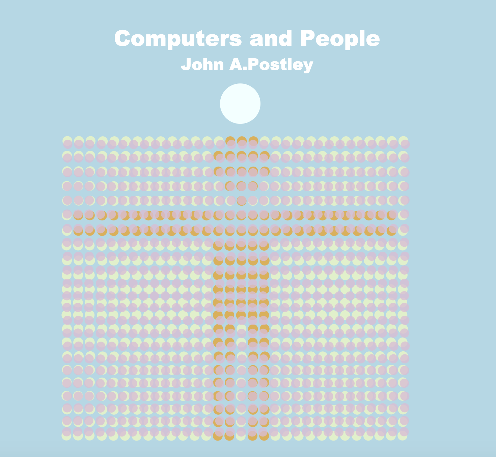
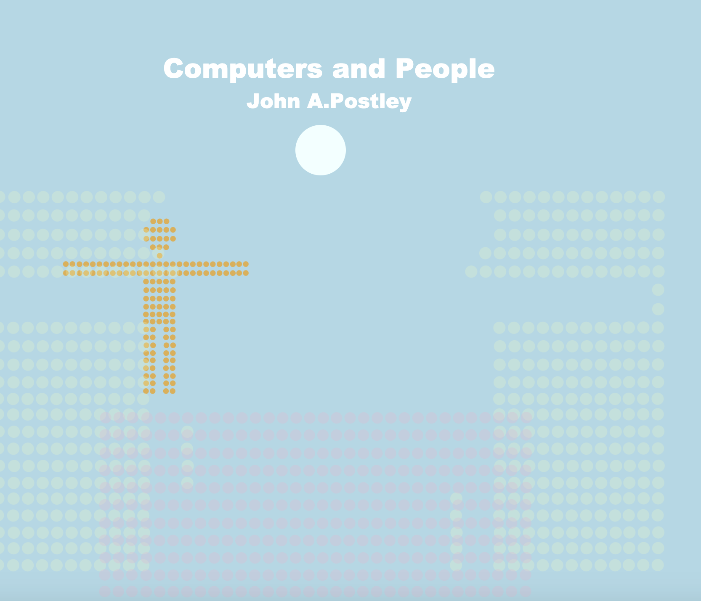
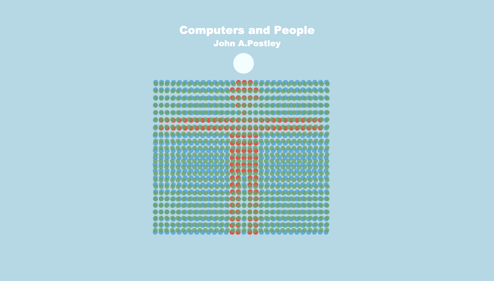

# web-animatie
Link: https://jemiah.github.io/web-animatie/

## Kunstwerk
Dit is mijn gekozen kunstwerk:


Ik heb gekozen voor dit werk omdat ik het leuk vind dat het uit kleine cirkels bestaat die samen een groter geheel vormen. Het kunstwerk komt van Phaidon(drive). Ik heb geprobeerd om meer te weten te komen over mijn kunstwerk maar ik heb in principe niks gevonden. Mijn kunstwerk moet de kaft van een boek voorstellen die door John A. Postley in 1963 is geschreven. Het boek gaat naar mijn idee over hoe computers werden ingezet voor jouw bedrijf. Ik heb het geïllustreerde gedeelte en de naam van het boek nagemaakt in Illustrator. De rest van de kaft vond ik niet zo mooi omdat het er verouderd uitziet.  

# Functies
Om het kunstwerk interactief te maken heb ik 3 functies bedacht:

1. Als de pagina laad zie je de rode pop vervolgens schuiven er 2 blauwe lagen in elkaar. Daarna komt de groene laag in beeld en wordt de laag geplaatst over de blauwe laag en het rode poppetje.



```CSS 
.blauw_links {
    transition: transform 5s ease-in;
    animation-duration: 5s;
    animation-name: naarRechts;
}

@keyframes naarRechts {
    from {
        transform: translateX(-45em);
    }

    to {
        transform: translateX(0em);
    }
}
```
In css heb ik met `keyframes` ervoor gezorgt dat de linkerkant van de blauwe laag eerst uit beeld is en daarna in beeld komt. Hetzelfde heb ik gedaan met de rechterkant.
```CSS
.groen {
    transition: transform 5s ease-in;
    animation-duration: 5s;
    animation-name: naarAchteren;
    animation-delay: 5s;
    animation-fill-mode: forwards;
    opacity: 0%;
}

@keyframes naarAchteren {
    from {
        transform-origin: center;
        opacity: 0%;
        transform: scale(4);
    }

    to {
        opacity: 100%;
        transform: scale(1);
    }
}
```
Met de groene laag heb ik ervoor gezorgd dat hij in het midden staat en kleiner wordt wanneer hij op de blauwe laag zit.

---
2. Als je op de witte knop klikt veranderen de kleuren van het kunstwerk. 


```CSS
.kleur1 {
    fill: #ECA400;
    transition: transform 2s ease-in;
}

.kleur2 {
    fill: #EAF8BF;
    transition: transform 2s ease-in;
}

.kleur3 {
    fill: #DDBDD5;
    transition: transform 2s ease-in;
}
```

In CSS heb ik de classes gemaakt die worden opgeroepen wanneer je op de witte knop klikt.
```JS
/*element selecteren*/
var pop = document.querySelector(".rood-pop");
var button = document.querySelector(".knop");
var button2 = document.querySelector(".knop2");
var blauwLinks = document.querySelector(".blauw_links");
var blauwRechts = document.querySelector(".blauw_rechts");
var groen = document.querySelector(".groen");

/*luisteren naar een event*/
button.addEventListener('click', toggle);


/*css aanpassen, class toevoegen*/
function toggle() {
    pop.classList.toggle('kleur1');
    blauwLinks.classList.toggle('kleur2');
    blauwRechts.classList.toggle('kleur2');
    groen.classList.toggle('kleur3');
    
    console.log("test3");
}
```
In Javascript selecteer ik de lagen van de svg. Vervolgens zorg ik ervoor dat wanneer je op de button klikt de classes in CSS worden opgeroepen.

---
3. Als je op de letter C (computers) klikt verdwijnt het kunstwerk. Eerst schuift de groene laag naar beneden. Vervolgens schuiven de 2 blauwe lagen uit elkaar en als laatst verdwijnt de rode pop. Het idee was eerst dat de rode pop draait op zijn plek en kleiner wordt totdat het verdwijnt maar de rode pop draaide rond het hele svg en niet op zijn plek.
Op de mobiel krijg je de optie om op een groene knop te klikken zodat die functie ook gebruikt kan worden op de mobiel.



```CSS
.groen2 {
    transition: transform 5s ease-in;
    animation-duration: 5s;
    animation-name: omlaag;
    animation-delay: 1s;
    animation-fill-mode: both;
    animation-iteration-count: 1;
    opacity: 100%;

}

@keyframes omlaag {
    from {
        transform: translateY(0em);
        opacity: 100%;
    }

    to {
        transform: translateY(30em);
        opacity: 0%;
    }
}
```
Eerst verdwijnt de groene laag door middel van een transitie.

```CSS
.br {
    transition: transform 4s ease-in;
    animation-duration: 4s;
    animation-name: verdwijnRechts;
    animation-delay: 1s;
    animation-fill-mode: both;
    animation-iteration-count: 1;
}

.bl {
    transition: transform 4s ease-in;
    animation-duration: 4s;
    animation-name: verdwijnlinks;
    animation-delay: 1s;
    animation-fill-mode: both;
    animation-iteration-count: 1;
}

@keyframes verdwijnlinks {
    from {
        transform-origin: center center;
        transform: translateX(-45em);
        transform: rotateX(0);
        opacity: 100%;
    }

    to {
        transform: translateX(-15em);
        opacity: 0%;

    }
}

@keyframes verdwijnRechts {
    from {
        transform-origin: center center;
        transform: translateX(45em);
        transform: rotateX(0);
        opacity: 100%;
    }

    to {
        transform: translateX(15em);
        opacity: 0%;

    }
}
```
Vervolgens schuift de blauw laag uit elkaar en verdwijnt het.

```CSS
.roodpoppetje {
    transition: transform 5s linear;
    animation-duration: 5s;
    animation-name: wormgat;
    animation-delay: 1s;
    animation-fill-mode: both;
    animation-iteration-count: 1;
}

@keyframes wormgat {

    from {
        transform-origin: center;
        transform: scale(1);
    }

    to {

        transform: scale(0);
    }
}
```
Het rode poppetje wordt kleiner en verdwijnt ook.
```JS
window.addEventListener('keydown',verdwijn);

/*css aanpassen, class toevoegen*/
function verdwijn(event){
    if (event.keyCode === 67){
        groen.classList.toggle('groen2');
        blauwLinks.classList.toggle('bl');
        blauwRechts.classList.toggle('br');
        pop.classList.toggle('roodpoppetje');
    }
}
```

```JS
button2.addEventListener('click',verdwijn2);

function verdwijn2(){
groen.classList.toggle('groen2');
blauwLinks.classList.toggle('bl');
blauwRechts.classList.toggle('br');
pop.classList.toggle('roodpoppetje');  
}
```
In Javascript heb ik ervoor gezorgd dat wanneer je op de letter C klikt de animatie wordt gestart. Ook werkt de animatie wanneer je op de groene knop klikt die alleen zichtbaar is op de mobiel en ipad.

---

Overige ideeën die ik niet heb uitgewerkt omdat ik niet genoeg tijd had:
1.	Ik wilde dat de cirkels 1 voor 1 heel snel in beeld komen maar dat kost heel veel tijd omdat het kunstwerk uit meer dan 100 cirkels bestaat.
2.	Een hover toevoegen op de svg die ervoor zorgt dat je een soort glinster effect ziet die van de rechterhoek boven naar de linkerhoek beneden gaat maar helaas was dit niet gelukt.
3.	Wanneer je op de button klikt golft het kunstwerk alsof het op water ligt.
4.	Een hover toevoegen voor de rode pop die ervoor zorgt de rode pop voor de groene laag staat en je een schaduw ziet.


## HTML
In mijn HTML staan er 2 knoppen en mijn kunstwerk die ik heb omgezet naar een svg.

## CSS
Een van de goals van dit vak is om je kennis op het gebied van CSS te verbreden. Tijdens dit vak heb ik nieuwe elementen geleerd zoals:
-	Animation
-	Animation-name
-	Animation-delay
-	Animation-iteration
-	Animation-fill-mode
-	Keyframes
-	Transition
-	Transform
-	Fill
-	From To

Voor bijna alle functies heb ik gebruik gemaakt van keyframes. Werken met keyframes vind ik niet zo moeilijk maar soms liep ik wel vast met transform. Soms zag de animatie er niet uit zoals ik dat wilde als oplossing hiervoor ging ik research doen naar het probleem of een andere animatie verzinnen. Verder heb ik ook gewerkt met `:nth-of-type()` voor de tekst.


## Javascript
Ik heb Javascript gebruikt voor de knoppen. Hiervoor selecteer ik een element en zorg ik ervoor dat het luistert naar een event. Vervolgens roept het een class op in CSS. Ik vind het best wel lastig om met Javascript te werken maar het is mij toch gelukt om ermee te werken.
Wat voor mij nieuw was in Javascript is het gebruiken van een `KeyCode`. Hierdoor kan je een toets op je toetsenbord gebruiken om een interactie te starten.

## Responsive
Om mijn website responsive te maken heb ik heb gewerkt met 3 breakpoints. Om het responsive te maken hebben ik gebruik gemaakt van `@media query’s`. In principe zijn alle functies die ik heb uitgewerkt te zien op alle breakpoints behalve de hovers.

### Computer:

Op de computer zie je de witte knop en heb je de optie om op de letter C te klikken via je toetsenbord om een animatie te starten.


### Ipad:

Als je een ipad hebt krijg je 2 knoppen in plaats van 1 knop te zien omdat een ipad geen toetsenbord heeft. 


### Telefoon:

Ik heb een Iphone 8 plus en heb dit voormaat aangehouden als breakpoint. Op de telefoon krijg je ook 2 knoppen te zien zodat alle functies zichtbaar zijn op elk formaat. 
 

## Bronnen:
-	Animation-fill-mode. (2019, 18 maart). Geraadpleegd op 17 mei 2020, van https://developer.mozilla.org/en-US/docs/Web/CSS/animation-fill-mode

-	Animations voor de dames. (z.d.). Geraadpleegd op 14 mei 2020, van https://sinds1971.nl/cssvoordedames/8-animations.html

-	DevTips. (2016). CSS Animation & Keyframes (CSS Animations Series Part 2) [Videobestand]. YouTube. Geraadpleegd op 16 mei 2020, van https://www.youtube.com/watch?v=f1WMjDx4snI&t=289s

-	Eden, D., Mesquita, E., & Gonzaga, W. (z.d.). Animate.css. Geraadpleegd op 17 mei 2020, van https://animate.style

-	TechTuber. (2019). CSS Animation Tutorial - Translate Property [Videobestand]. YouTube. Geraadpleegd op 15 mei 2020, van https://www.youtube.com/watch?v=KhfCHID71zI&t=244s

-	Using two CSS classes on one element. (2012, 11 augustus). Geraadpleegd op 15 mei 2020, van https://stackoverflow.com/questions/11918491/using-two-css-classes-on-one-element

-	W3schools. (z.d.). CSS animation Property. Geraadpleegd op 15 mei 2020, van https://www.w3schools.com/cssref/css3_pr_animation.asp


